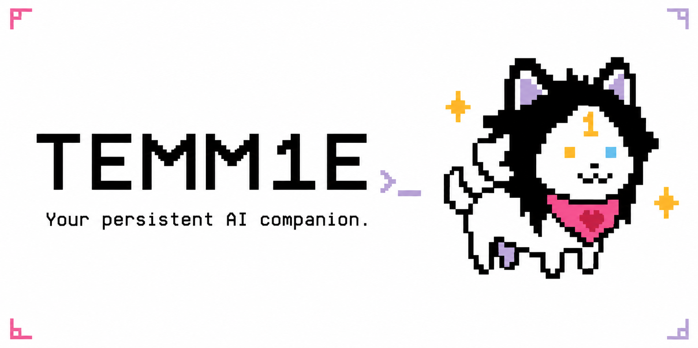

<p align="center">
  
</p>

<p align="center">
  <a href="https://github.com/temm1e-labs/temm1e/releases"></a>
  <a href="Cargo.toml"></a>
  <a href="https://discord.com/invite/temm1e"></a>
</p>

**Temm1e is a persistent AI companion and agent runtime written in Rust.** Talk to Tem in your terminal or messaging app. Tem can work with files, code, the web and your desktop, retain useful memories, and return to scheduled work.

The product idea is simple: a familiar companion that gets useful work done, learns from experience, and tells you honestly what happened. You choose the model; Tem supplies the tools, memory and execution infrastructure.

[Get started](#get-started) · [Features](docs/FEATURE_GUIDE.md) · [Commands](docs/CLI_REFERENCE.md) · [Vision](VISION.md) · [Release history](docs/RELEASE_HISTORY.md)

> **Modernization branch:** the 6.0 overhaul is in progress. The installer below installs the latest published release, not this branch. See the [implementation status](docs/modernization/IMPLEMENTATION-STATUS.md), [audit](docs/modernization/README.md) and [A/B protocol](docs/modernization/BENCHMARK-PROTOCOL.md). No 6.0 performance improvement or release readiness is claimed yet.

## Get started

On macOS or Linux:

```bash
curl -sSfL https://raw.githubusercontent.com/temm1e-labs/temm1e/main/install.sh | sh
temm1e tui
```

The first-run wizard walks you through connecting a model provider. You can also download a platform binary from [GitHub Releases](https://github.com/temm1e-labs/temm1e/releases).

To build the checked-out source:

```bash
git clone https://github.com/temm1e-labs/temm1e.git
cd temm1e
cargo build --release
./target/release/temm1e tui
```

Use `temm1e chat` for a basic terminal conversation, or `temm1e start` to run the messaging gateway. Browser tools need Chrome or Chromium. Desktop control needs the appropriate OS permissions and display session; see the [desktop deployment guide](docs/DEPLOY_AUTONOMOUS_DESKTOP.md).

## Choose your connection

Tem supports Anthropic, OpenAI-compatible services, Gemini and local endpoints. Use the setup wizard to choose a provider and model, then `/model` to inspect or change the active model.

| Connection | Setup | What to expect |
|---|---|---|
| Provider API key | `temm1e setup` or the TUI wizard | Provider API billing and limits apply. |
| ChatGPT / Codex login | `temm1e auth login` | Uses the existing Codex OAuth integration; account eligibility and limits apply. |
| Z.ai Coding Plan | Choose **Z.ai Coding Plan** in the TUI wizard | Added on this branch. Uses the dedicated coding-plan endpoint with `glm-5.3-flash`; validated by a live tool-use smoke test. |
| Local / compatible service | Configure a compatible endpoint | Supported capabilities depend on the endpoint and model. |

A coding subscription and a general API account are distinct connections. Tem's new Z.ai coding-plan adapter rejects accidental substitution of the general API endpoint. Its live smoke test establishes technical compatibility; it does not establish official provider support for Temm1e. See [subscription research and constraints](docs/modernization/06-SUBSCRIPTIONS.md).

## What Tem can do

| Area | Features | Read more |
|---|---|---|
| Work on your computer | Shell, file operations, Tem-Code editing, browser and desktop tools | [Coding and computer use](docs/FEATURE_GUIDE.md#coding-and-computer-use) |
| Remember and adapt | λ-Memory, Engram, reusable blueprints, reflective lessons and Anima | [Memory and personality](docs/FEATURE_GUIDE.md#memory-and-personality) |
| Coordinate work | Many Tems swarm and TemDOS specialist cores | [Coordination](docs/FEATURE_GUIDE.md#coordination) |
| Stay available | Messaging gateway, schedules, Perpetuum concerns and monitors | [Persistent work](docs/FEATURE_GUIDE.md#persistent-work) |
| Extend capabilities | Skills, MCP tools, optional Eigen-Tune and Cambium | [Extensions and experiments](docs/FEATURE_GUIDE.md#extensions-and-experiments) |
| Inspect outcomes | Witness checks, Vigil diagnostics, usage reporting | [Evidence and diagnostics](docs/FEATURE_GUIDE.md#evidence-and-diagnostics) |

These systems have different maturity levels. The [feature audit](docs/modernization/FEATURE-COVERAGE.md) traces the intended behavior to code, identifies gaps, and defines the remaining modernization work. Feature illustrations show concepts; they are not screenshots or benchmark results.

## Run as a messaging companion

Configure your provider, then supply the token for a channel you use:

```bash
export TELEGRAM_BOT_TOKEN="your-bot-token"
temm1e start
```

Discord is available through `DISCORD_BOT_TOKEN`. Other channel integrations and deployment options are documented in the repository. Review access controls before exposing a shared deployment: a personal agent with shell or desktop access operates with substantial access to its host.

Configuration normally lives in `~/.temm1e/config.toml`. `temm1e config validate` checks configuration. Back up your configuration and persistent data before upgrading. The modernization release will include migration and upgrade validation before it is published.

## Learn more

- [Feature guide](docs/FEATURE_GUIDE.md) — a concise tour with links to each design.
- [CLI reference](docs/CLI_REFERENCE.md) — terminal and in-chat commands.
- [Product vision](VISION.md) — the creator's guiding principles.
- [Research lab](tems_lab/) — feature designs and historical experiments.
- [Modernization audit](docs/modernization/README.md) — findings, implementation plans and validation status.
- [Release history](docs/RELEASE_HISTORY.md) — previous versions, preserved separately for readability.

## Development

```bash
cargo check --workspace
cargo test --workspace
cargo clippy --workspace --all-targets --all-features -- -D warnings
cargo fmt --all -- --check
```

See [CLAUDE.md](CLAUDE.md) for repository conventions and the [release protocol](docs/RELEASE_PROTOCOL.md) for release gates. Test counts and historical benchmarks are evidence for specific checks, not guarantees that every production path works.

[MIT license declared in package metadata](Cargo.toml). Built for people who want a companion they can run, understand and improve.
