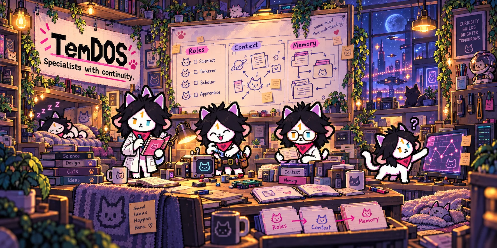
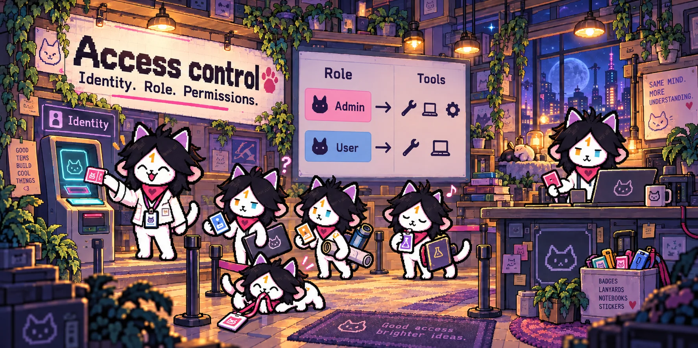
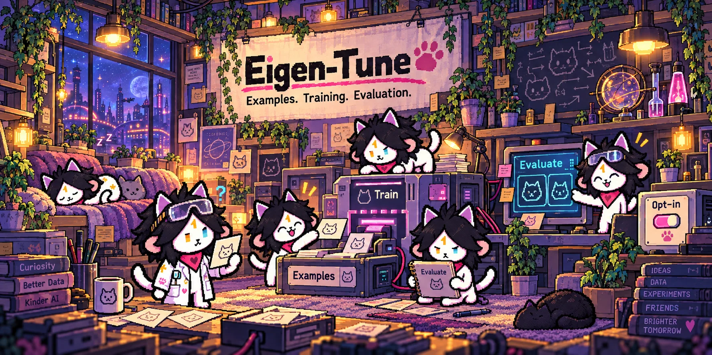

<p align="center">
  
</p>

<p align="center">
  <a href="https://github.com/temm1e-labs/temm1e/releases"></a>
  <a href="Cargo.toml"></a>
  <a href="https://discord.com/invite/temm1e"></a>
</p>

**Temm1e is a persistent AI companion and agent runtime written in Rust.** Talk to Tem in your terminal or messaging app. Tem can work with files, code, the web and your desktop, retain useful memories, and return to scheduled work.

Choose your model, connect your tools, and keep the same companion across conversations. Tem combines practical work with memory and personality; execution records help you inspect what actually happened.

[Get started](#get-started) · [Vision](#an-entity-one-api-call-at-a-time) · [Mathematics](#the-mathematics-inside-tem) · [Tem’s mind](#tems-mind) · [Features](#coding-and-computer-use) · [Connections](#choose-your-connection) · [Architecture](#architecture) · [Commands](#commands) · [Upgrade](docs/modernization/UPGRADING.md)

Tem is a companion you can work with over time: a practical agent with memory, a familiar personality, and room to explore. The systems below explain how that idea becomes code, browser work, specialist collaboration, reflection and scheduled activity. They have different maturity levels; each section links to the design behind it.

## An entity, one API call at a time

Temm1e is built around an ambition: **give episodic intelligence a continuing existence.** The LLM supplies reasoning, intelligence and verdicts one call at a time. Tem supplies an environment to act in, memory to carry forward, temporal machinery to return to work, and records of what happened.

Computer use and native browser sessions let Tem inhabit a digital environment. Perpetuum explores around-the-clock availability and scheduled return. Persistence and recovery aim to preserve continuity when a call or process stops. This is an **AGI-oriented architectural direction**, not a claim that Tem has achieved AGI, consciousness or uninterrupted autonomous operation.

[Read the illustrated essay: **Building a place for intelligence to persist**](https://temm1e-labs.github.io/temm1e/)

## The mathematics inside Tem

Tem is mathematically curious. Its equations make design choices inspectable: how attention fades, how lessons are ranked, how workers select tasks, and how much evidence supports a verdict. Mathematical correctness, useful proxies and proven user outcomes are different things; the explanations below keep that distinction visible.

### λ-memory: a continuous attention curve

$$
s(t)=I_{\mathrm{eff}}e^{-\lambda\Delta t},\qquad I_{\mathrm{eff}}=\operatorname{clamp}(I+b,0.1,5.0)
$$

The score combines importance and recall boost with exponential decay in **hours since last access**. Lower scores move memories toward smaller context representations; raw stored content can remain available for recall. At $\lambda=0.01\,\mathrm{h}^{-1}$, the score half-life is $\ln(2)/\lambda\approx69.3$ hours, or **2.89 days**, with effective importance held fixed. This controls context attention, not factual truth or guaranteed archival retention.

<details>
<summary>Learning artifacts: Bayesian quality × recency × use</summary>

$$
V=\frac{\alpha}{\alpha+\beta}\,e^{-0.015d}\,[1+0.3\ln(1+u)]
$$

Here $d$ is days since creation and $u$ counts applications. The Beta mean contributes estimated quality; exponential recency has a 46.2-day half-life; logarithmic reinforcement gives repeated use diminishing marginal influence. Model confidence $c$ initializes $\alpha=2+3c$ and $\beta=2+3(1-c)$, keeping the initial mean between $2/7$ and $5/7$ for $c\in[0,1]$.

This is a ranking heuristic. A model-seeded prior is not independent evidence, and application counts measure exposure rather than demonstrated benefit. [Implementation](crates/temm1e-agent/src/learning.rs).

</details>

<details>
<summary>Perpetuum: time, observations and a Beta prior</summary>

$$
\hat p=\frac{a+1}{n+2}
$$

For matching local weekday/hour slots in the previous 28 completed local calendar days, $a$ counts active slots and $n$ eligible slots after the first recorded day. Beta(1,1) smoothing gives **2/6** for one active slot out of four, and 0.5 when there are no eligible slots. Missing slots currently count as inactive after recording starts; this estimates recorded behavior, not verified online exposure. Non-whole-hour timezone offsets remain approximate with existing UTC buckets. [Implementation](crates/temm1e-perpetuum/src/store.rs).

</details>

<details>
<summary>Many Tems: a mathematical policy for task selection</summary>

$$
S=A^\alpha U^\beta(1-D)^\gamma(1-F)^\delta R^\zeta
$$

Affinity, urgency, difficulty, failure and reward signals combine into a worker/task priority score. Exponents control their relative influence; the implementation floors or clamps inputs. It is a coordination heuristic, not a proof of optimal scheduling, fairness or speedup. Dependency checks and claims are separate mechanisms. [Implementation](crates/temm1e-hive/src/selection.rs).

</details>

<details>
<summary>Eigen-Tune: Wilson intervals and sequential evidence</summary>

For observed proportion $\hat p=k/n$, the Wilson lower bound is:

$$
L=\frac{\hat p+z^2/(2n)-z\sqrt{\hat p(1-\hat p)/n+z^2/(4n^2)}}{1+z^2/n}
$$

At **99% two-sided confidence**, even 30/30 successes has a lower bound of only **0.818891**. The checked implementation rejects zero trials, impossible counts and invalid confidence. Binomial assumptions and label quality still matter. [Wilson implementation](crates/temm1e-distill/src/stats/wilson.rs).

The sequential probability ratio test accumulates:

$$
\Lambda_n=\sum_{i=1}^{n}\left[x_i\ln\frac{p_1}{p_0}+(1-x_i)\ln\frac{1-p_1}{1-p_0}\right]
$$

It compares this with Wald boundaries $\ln((1-\beta)/\alpha)$ and $\ln(\beta/(1-\alpha))$. Reaching the sample cap without crossing a boundary returns **Inconclusive**. Error-control arguments depend on independent Bernoulli outcomes and fixed hypotheses; they do not automatically apply to an adaptive agent. Here $\alpha,\beta$ are error targets, not the learning prior parameters above. [SPRT implementation](crates/temm1e-distill/src/stats/sprt.rs).

</details>

<details>
<summary>Witness: preserve unknowns when composing verdicts</summary>

$$
\neg\,? = ?,\qquad \mathrm{T}\land ? = ?,\qquad \mathrm{F}\land ? = \mathrm{F}
$$

Three-valued logic keeps verified, failed and inconclusive checks distinct. Negating missing evidence cannot create success. Under the explicit verification policy, empty and entirely advisory check sets remain inconclusive. A model verdict still does not prove that an action executed. [Implementation and truth tables](docs/modernization/WITNESS-KNOWNNESS-IMPLEMENTATION.md).

</details>

[λ-memory implementation](crates/temm1e-agent/src/lambda_memory.rs) · [Complete mathematical audit](docs/modernization/MATH-AUDIT.md) · [Feature implementation ledger](docs/modernization/FEATURE-COVERAGE.md)

## Get started

On macOS or Linux:

```bash
curl -sSfL https://raw.githubusercontent.com/temm1e-labs/temm1e/main/install.sh | sh
temm1e tui
```

The first-run wizard walks you through connecting a model provider. You can also download a platform binary from [GitHub Releases](https://github.com/temm1e-labs/temm1e/releases).

To build the checked-out source, use Rust 1.91.1 or newer:

```bash
git clone https://github.com/temm1e-labs/temm1e.git
cd temm1e
cargo build --release
./target/release/temm1e tui
```

Use `temm1e chat` for a basic terminal conversation, or `temm1e start` to run the messaging gateway. Browser tools need Chrome or Chromium. Desktop control needs the appropriate OS permissions and display session; see the [desktop deployment guide](docs/DEPLOY_AUTONOMOUS_DESKTOP.md).

## Choose your connection

Tem supports Anthropic, OpenAI-compatible services, Gemini and local endpoints. Use the setup wizard to choose a provider and model, then `/model` to inspect or change the active model. In CLI/server, selection applies to the running instance and keeps saved startup defaults unchanged.

| Connection | Setup | What to expect |
|---|---|---|
| Provider API key | `temm1e setup` or the TUI wizard | Provider API billing and limits apply. |
| ChatGPT / Codex login | `temm1e auth login` | Uses the existing Codex OAuth integration; account eligibility and limits apply. |
| Z.ai Coding Plan | Choose **Z.ai Coding Plan** in the TUI wizard | Uses the dedicated coding-plan endpoint with `glm-5.3-flash`; validated by a live tool-use smoke test. |
| Local / compatible service | Configure a compatible endpoint | Supported capabilities depend on the endpoint and model. |

A coding subscription and a general API account are distinct connections. Tem's new Z.ai coding-plan adapter rejects accidental substitution of the general API endpoint. Its live smoke test establishes technical compatibility; it does not establish official provider support for Temm1e. See [subscription research and constraints](docs/modernization/06-SUBSCRIPTIONS.md).

## Tem’s mind

A model provides reasoning; the harness decides how a turn is assembled, which tools it can use, what fits in context, how work is recorded and when resources are released. Tem’s agent loop brings those responsibilities together:

1. **Understand the request.** Combine the current conversation with relevant instructions, memory and available tools. Complexity-aware planning can break suitable work into steps.
2. **Act and observe.** Execute tools and return their real output to the model. Track failures so the next attempt can change strategy instead of blindly repeating the same action.
3. **Manage context.** Keep the current request and execution state useful within the model’s context window, with room reserved for output.
4. **Record the outcome.** Preserve conversation, execution and final-reply state. Checks and evidence establish specific properties; a final answer alone does not certify the goal.
5. **Release owned work.** Bound background activity and account for its provider usage, including failure and cancellation paths.

The selected model remains part of the user’s control. CLI/server model changes preserve running state and do not silently rewrite saved defaults. Optional local routing has its own explicit qualification and enablement path.

### Context, compaction and caching

Long conversations need more than dropping the oldest messages. Modernization keeps raw history and source references when it compacts the active context, so scoped recall can recover detail that no longer fits in a request. Provider-native replay preserves the forms of conversation state that each backend needs; incompatible state is normalized when deriving a request for a different model.

Context compaction, long-term memory and provider caching solve different problems. Compaction determines what is sent now. Memory retains useful information across work. Provider caching may reduce repeated processing when the provider supports it. Tem reports cache reads/writes when supplied and preserves unknown usage as unknown; it does not assume a cache hit or that a coding subscription makes requests free.

[Context and caching](docs/modernization/07-CONTEXT-CACHING.md) · [Runtime model ownership](docs/modernization/RUNTIME-MODEL-CLOSEOUT.md) · [Feature and math audit](docs/modernization/FEATURE-COVERAGE.md)

## Coding and computer use

### Tem-Code

Tem-Code is the hands-on coding layer: inspect files and repository state, change the relevant code, then run checks that exercise the requested behavior. Shell, file and Git operations let Tem work in an existing project rather than only produce snippets. Useful state and execution evidence remain available when work spans multiple turns.

A typical request is “find why this test fails, fix it and show what you ran.” The model chooses actions; tool output and independent checks establish what happened. A successful command is evidence for that command, not a blanket guarantee about the project.

[Research](tems_lab/code/RESEARCH.md)


### Prowl and Gaze

Prowl is for work in a browser: inspect a page, follow navigation, interact with controls and use a dedicated authenticated browser profile. Its login workflow lets browser work retain a session without automatically copying your everyday Chrome profile. Explicit profile import is bounded and remains an intentional action.

Gaze extends the idea to the desktop through screenshots and input actions. It is useful when an application has no suitable API or browser interface. Browser and desktop permissions, display availability and the chosen model’s vision support determine what Tem can do; verify the resulting application state after an action.

[Desktop design](tems_lab/gaze/DESIGN.md) · [Deployment](docs/DEPLOY_AUTONOMOUS_DESKTOP.md)


### Web search

Search gives Tem a way to discover sources before opening and comparing them. The unified interface can fan out to configured backends, while query parameters and ordering are part of the cache identity. You can ask Tem to investigate a subject and bring back the source material that supports its answer.

Backend availability, rate limits and freshness differ. Search results are inputs to research; their presence does not establish that a claim is true. The research documentation describes the backend design without treating historical backend counts as a permanent service guarantee.

[Search research](docs/web_search/RESEARCH.md)


## Memory and personality

### λ-Memory and Engram

λ-Memory is built around a companion that can forget detail without losing the path back to an experience. An episode can be represented at several levels—detail, summary, essence and reference—so useful meaning can fit into limited context while the source remains available for recall.

Engram handles longer-lived facts and explicit “remember this,” corrections and forgetting. Its records must stay attached to the right identity; the modernization adds stricter scoping and persistence behavior. Neither a high memory score nor repeated recall proves a remembered fact is correct. Your correction should remain more important than an old model inference.

[λ-Memory](tems_lab/LAMBDA_MEMORY.md) · [Engram](tems_lab/ENGRAM_MEMORY.md) · [Context and caching audit](docs/modernization/07-CONTEXT-CACHING.md)


### Blueprints and artifact value

Blueprints turn useful procedures into material Tem can reuse: the steps, preconditions and lessons from solving a kind of problem. A blueprint is a starting point for the next task, and still needs to fit the current repository, tools and constraints.

Artifact value is the selection idea behind memories, lessons and procedures competing for attention. Quality, recency and utility help rank what to bring into context. These are decision signals, not measured probabilities of correctness. The math audit distinguishes implemented calculations, repaired numerical boundaries and longer-term redesign proposals.

[Blueprint design](docs/design/BLUEPRINT_SYSTEM.md) · [Artifact value design](tems_lab/ARTIFACT_VALUE_FUNCTION.md) · [Math audit](docs/modernization/MATH-AUDIT.md)


### Conscious and Anima

Conscious provides a reflection layer that can observe activity and retain lessons. In the modernization, observer state is bounded and tied to the current workspace, conversation and user, and its model calls participate in owning resource accounting. Reflection should help the next decision rather than silently replace the user’s objective.

Anima gives the companion a recognizable voice and relationship continuity: a Tem that can be playful, attentive, curious or constructively disagree. Personality and user preferences shape how Tem communicates; they do not turn an emotional impression into a fact. The creator’s vision is expressed through behavior as well as the character’s visual identity.

[Conscious research](tems_lab/consciousness/RESEARCH_PAPER.md) · [Anima architecture](tems_lab/social/TEM_EMOTIONAL_INTELLIGENCE_ARCHITECTURE.md)


## Coordination

### Many Tems

Many Tems is the swarm model: split suitable work into dependency-aware tasks, give workers bounded responsibilities, then collect their outcomes through a shared Den. Independent investigation and implementation can proceed together when their inputs and outputs are clear.

Coordination introduces its own cost. Shared-state updates, cancellation, task dependencies and owning budgets matter just as much as starting workers. Modernization strengthens those boundaries; it does not claim that every task gets faster by adding more agents. Historical swarm experiments remain available with their original workloads and conditions.

[Swarm design](tems_lab/swarm/DESIGN.md) · [Historical experiment](docs/swarm/experiment_artifacts/EXPERIMENT_REPORT.md)


### TemDOS

TemDOS gives Tem specialist cores with their own role and continuity—such as research, code review or debugging. A core can keep expertise and context associated with that role across work, while a temporary swarm worker exists to complete a bounded assignment.

The modernization tightens the relationship between a core’s selected model, pricing metadata, tool resources and parent budget. Changing models must not silently reuse incompatible provider state or charge the same work twice. Specialist identity is useful organization; it is not proof of expertise or correctness.

[TemDOS research](tems_lab/temdos/TEMDOS_RESEARCH_PAPER.md)



## Persistent work

### Perpetuum

Perpetuum expresses the idea that Tem can return to things over time: schedules, concerns, monitors and background initiative. You can keep an ongoing concern alongside an immediate conversation, with time-aware work handled by the configured services.

Those services need clear ownership, current model/resource bindings and honest outcomes. A skipped maintenance action is reported as skipped. A saved reply does not mean an entire long-running goal has been achieved. Fully automatic durable pursuit across every restart and failure remains a separate design boundary.

[Perpetuum vision](tems_lab/perpetuum/VISION.md)


### Terminal and messaging

The terminal centers the conversation: streamed text, compact tool rows, expandable details and optional activity panels. Use **Ctrl+T** to expand or collapse tool details and **Ctrl+O** for the activity panel. Saved history lets a conversation continue without reconstructing everything from a screenshot or an old scrollback.

Messaging brings the same companion into the channels you use. The CLI, TUI and gateway have distinct initialization and delivery paths, so their acceptance evidence is checked separately. The drawing below is a concept illustration; the command reference describes the actual controls.

[TUI design plan](docs/modernization/08-TUI.md) · [Commands](docs/CLI_REFERENCE.md)


### Access control

Tem uses **Admin** and **User** roles to determine which management operations and tools are available. This lets a personal owner distinguish their own controls from other participants in a channel. Server recovery and management commands require the appropriate existing role.

Role checks, scoped records and private files address different boundaries. A host-level shell or desktop tool still acts with the process’s operating-system access. Use a dedicated host or an external isolation layer where that access must be constrained; Tem does not claim complete multi-tenant sandboxing.

[Isolation findings](docs/modernization/03-FINDINGS.md)



## Extensions and experiments

### Skills and MCP

Skills package reusable instructions and working methods in global or workspace directories. They help Tem approach recurring tasks consistently while keeping the user’s current request in charge. Use `temm1e skill list` to inspect available skills.

MCP connects external tools and services through supported transports. Use `/mcp` to inspect connected servers and the command reference for configuration. Tools extend what the agent can do, while their returned text remains external input. Custom tools and self-created extensions also need review appropriate to the access they receive.

### Eigen-Tune

Eigen-Tune explores a companion that learns from examples and can eventually route suitable work to a local model. The pipeline collects training pairs, trains with a supported backend and evaluates the result against a reference before qualification. It is useful to experiment with a narrower local capability while retaining a stronger reference model.

Collection/training and user-facing local routing are **separate opt-ins**. Statistical gates can be inconclusive when the sample is insufficient; reaching a sample cap must not manufacture graduation. Training and inference consume compute and storage, and a change in the reference model can invalidate previous qualification. Start with the setup and routing-safety guides.

[Design](tems_lab/eigen/DESIGN.md) · [Setup](tems_lab/eigen/SETUP.md) · [Routing safety](tems_lab/eigen/LOCAL_ROUTING_SAFETY.md)



### Cambium

Cambium is Tem’s self-growth research: identify a capability gap, propose a change, evaluate it and preserve a recoverable history. Protected zones, the watchdog and review stages are intended to keep growth from erasing the foundations it depends on.

This is an experimental capability, not permission to trust arbitrary self-modification. Growth-specific evaluation remains distinct from ordinary answer verification. A passing file check or a confident model verdict must not grant unrelated deployment authority. Read the research and protected-zone documentation before enabling or extending the growth pipeline.

[Research](tems_lab/cambium/CAMBIUM_RESEARCH_PAPER.md) · [Protected zones](docs/lab/cambium/PROTECTED_ZONES.md)


## Evidence and diagnostics

### Witness

Witness connects claims with pre-committed checks and recorded evidence. Goal and assessment inspection make it possible to distinguish “the model returned an answer” from “this particular condition was checked.” Evidence can be attached to the execution that produced it rather than inferred from reassuring prose.

The modernized file-evidence path binds checks to captured content and explicit limits. A verifier can still have incomplete criteria: checking that a file exists does not establish that its algorithm is right. Unknown evidence stays unknown, and a local hash chain is not protection against an owner who can rewrite the whole store.

[Witness research](tems_lab/witness/RESEARCH_PAPER.md)


### Vigil

Vigil is the diagnostic layer: notice a failure, collect relevant context and prepare a report that can help explain it. A useful report separates the symptom, observed evidence and likely cause, with sensitive material excluded.

Reporting to an external destination depends on configuration and consent. A diagnosis is a starting point for investigation, not an automatic repair or proof that an upstream project is at fault.

[Vigil design](tems_lab/vigil/DESIGN.md)


## Channels and tools

| Surface | What it is for | Details |
|---|---|---|
| TUI | Interactive terminal conversation, streaming and inspectable tool activity | [Commands](docs/CLI_REFERENCE.md) |
| CLI chat | A simpler terminal conversation | [CLI](docs/channels/cli.md) |
| Telegram | A messaging companion through a bot connection | [Telegram setup](docs/channels/telegram.md) |
| Discord | Work with Tem in Discord | [Discord setup](docs/channels/discord.md) |
| Slack | Channel conversations and file delivery | [Slack setup](docs/channels/slack.md) |
| WhatsApp | Web-session and Cloud API integrations | [WhatsApp setup](docs/WHATSAPP_INTEGRATION.md) |
| HTTP gateway | Health/readiness, management and service integration | [Configuration](docs/CLI_REFERENCE.md) |

Tool families include shell execution, file read/write/list, Git, web fetch/search, browser interaction, desktop input, memory operations and recall, messaging/file delivery, key management, MCP management and custom extensions. Availability depends on build features, configuration, the selected model, platform support and role. External channel/account compatibility is distinct from local fixture acceptance.

### Recovery and saved replies

Tem saves final replies before delivery. When a process dies during a send, it preserves uncertainty rather than automatically sending another copy. `/delivery-status` and `/delivery-show` let you inspect the saved reply; `/delivery-resume` is for a reply that has never been attempted. A destination accepting a message is different from you reading it.

Conversation records are scoped to the selected profile’s canonical workspace and conversation identity. Legacy chats are preserved and imported explicitly; Tem does not guess which project an old unscoped chat belonged to. `/session-new` starts a new epoch while retaining old evidence. `/session-recover` restores recorded evidence without replaying tools. In the TUI, `/clear` clears the display only.

[History and delivery commands](docs/CLI_REFERENCE.md#conversation-history) · [Upgrade and rollback](docs/modernization/UPGRADING.md)

## Architecture

Tem is a Rust workspace organized around shared traits and distinct runtime services. The root binary assembles the CLI, TUI and gateway paths; feature crates provide the implementations.

| Layer | Packages and responsibilities |
|---|---|
| Shared contracts | `temm1e-core`: types, configuration, traits, policy and resource identities |
| Agent execution | `temm1e-agent`: context, tool loop, planning, recovery and evidence integration |
| Coordination | `temm1e-hive`: swarm workers and shared task state; `temm1e-cores`: TemDOS specialists |
| Models | `temm1e-providers`: native and compatible protocols; `temm1e-codex-oauth`: login and refresh |
| Interfaces | `temm1e-tui`, `temm1e-channels`, `temm1e-gateway`: terminal, messaging and HTTP entrypoints |
| Tools and extensions | `temm1e-tools`, `temm1e-gaze`, `temm1e-mcp`, `temm1e-skills` |
| Persistent data | `temm1e-memory`, `temm1e-vault`, `temm1e-filestore`: memory, encrypted secrets and files |
| Continuity | `temm1e-automation`, `temm1e-perpetuum`, `temm1e-anima`: schedules, concerns and personality |
| Evaluation and growth | `temm1e-distill`, `temm1e-cambium`, `temm1e-witness`: distillation, growth and verification |
| Operations | `temm1e-observable`, `temm1e-watchdog`, `temm1e-test-utils`: diagnostics, supervision and test support |

The same feature appearing in a library does not establish that every entrypoint exercises it. [Acceptance evidence](docs/modernization/CLOSEOUT-VALIDATION.md) records actual checks and their limits. Cloud orchestration, global tenant isolation and complete telemetry export remain separate maturity boundaries.

## Setup and access

The first-run wizard is the easiest way to configure a provider. For a messaging gateway, configure the provider, supply your chosen channel’s credentials and start Tem:

```bash
export TELEGRAM_BOT_TOKEN="your-bot-token"
temm1e start
```

Discord uses `DISCORD_BOT_TOKEN`; follow the linked setup guide for other channels. Browser tools need Chrome/Chromium. Gaze requires the relevant OS permissions and display session. The selected model must support the requested capabilities.

Configuration normally lives in `~/.temm1e/config.toml`. `TEMM1E_DATA_DIR` selects a different application profile; launching from another directory alone does not select a new project workspace. `temm1e config validate` checks configuration. Back up the selected profile before upgrading.

Tem can execute tools with substantial access to its host. Private credentials, role checks, scoped state and bounded processes improve specific boundaries; they do not provide an OS sandbox. Use external isolation when serving untrusted users or constraining host access. Self-growth, local training and external reporting deserve explicit configuration appropriate to their scope.

Known dependency advisories and their scope are documented in the [dependency review](docs/modernization/DEPENDENCY-CLOSEOUT.md). A green advisory CI job does not mean a vulnerability-free dependency tree.

## Commands

```text
temm1e setup                 Configure a provider
temm1e tui                   Open the terminal interface
temm1e chat                  Start a basic terminal conversation
temm1e start                 Start the gateway
temm1e stop                  Request graceful shutdown
temm1e status                Inspect running state
temm1e auth login            Start Codex OAuth login
temm1e auth status           Inspect authentication
temm1e config validate       Validate configuration
temm1e update                Download and verify the latest release
```

| In conversation | Purpose |
|---|---|
| `/model`, `/model <id>` | Inspect or select the active model |
| `/memory`, `/memory lambda`, `/memory echo` | Inspect or choose memory strategy |
| `/usage`, `/keys`, `/mcp` | Inspect usage, connections and external tools |
| `/login <service>` | Start a browser login workflow |
| `/eigentune` | Inspect and control optional distillation |
| `/history-import`, `/session-new`, `/session-recover` | Import or inspect preserved conversation state |
| `/delivery-status`, `/delivery-show <id>` | Inspect saved final replies |
| `/goal-status`, `/goal-assessment` | Inspect recorded execution and assessment evidence |

Model-selection persistence and command authorization differ by entrypoint; see the [complete CLI reference](docs/CLI_REFERENCE.md) for arguments and behavior.

## What changed in 6.0?

The modernization audits the creator’s feature ideas against their implementation, then repairs execution boundaries while preserving Tem’s personality and persistent-companion direction. Major changes include compact streaming TUI interaction, scoped native history and recovery, source-backed compaction, provider-native replay, explicit coding-plan setup, shared owning usage, model/resource binding, bounded background work and evidence records.

The frozen coding A/B used the same GLM-5.3-Flash Coding Plan connection and resource limits for both versions. Main passed 30/30; modern passed 29/30. The sole discordant prompt had an ambiguous return type; a separately frozen explicit-contract pair passed both. The original score stays unchanged. This supports a bounded engineering assessment, not a universal speedup or statistical equivalence claim.

[Full A/B results and traces](docs/modernization/CLOSEOUT-RESULTS.md) · [Product acceptance](docs/modernization/CLOSEOUT-VALIDATION.md) · [Release record](docs/modernization/RELEASE-6.0.md) · [Upgrade guide](docs/modernization/UPGRADING.md)

## Development and research

```bash
cargo check --workspace
cargo test --workspace
cargo clippy --workspace --all-targets --all-features -- -D warnings
cargo fmt --all -- --check
```

Use Rust 1.91.1 or newer. On a storage-constrained machine, `python3 scripts/cargo_guard.py -- build` reserves free space and removes disposable build output; see the [release protocol](docs/RELEASE_PROTOCOL.md) before keeping build caches. Test counts describe executed checks, not a guarantee about every user workflow.

- [Vision](VISION.md) — the creator’s guiding ideas.
- [Tem’s Lab](tems_lab/) — designs, research and historical experiments.
- [Modernization research](docs/modernization/README.md) — frontier harness comparisons, audit and implementation plans.
- [Feature coverage](docs/modernization/FEATURE-COVERAGE.md) — all 65 audited feature families and remaining gaps.
- [Implementation record](docs/modernization/IMPLEMENTATION-STATUS.md) — repairs and validation, with historical checkpoints preserved.
- [Artwork guidelines](docs/ART_DIRECTION.md) — character construction, expressions and the cozy punk-science Den.
- [Release history](docs/RELEASE_HISTORY.md) — previous versions and their original claims.
- [Repository conventions](CLAUDE.md) — development practices and workspace structure.

[MIT license declared in package metadata](Cargo.toml). Built for people who want a companion they can run, understand and improve.
