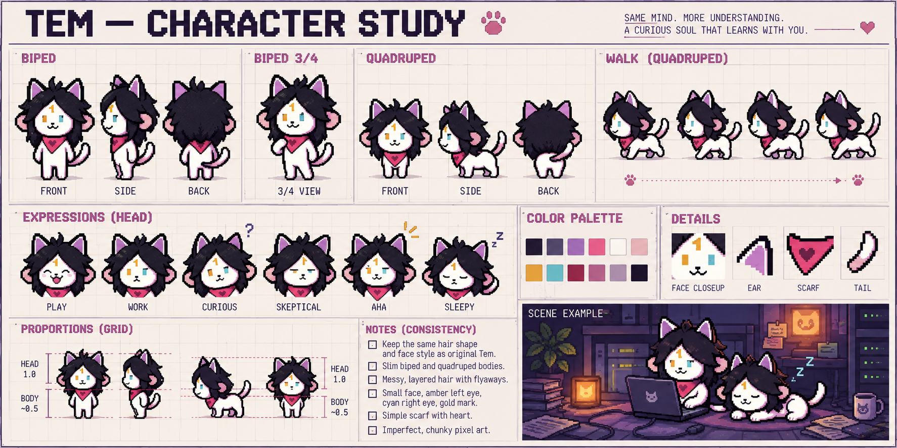
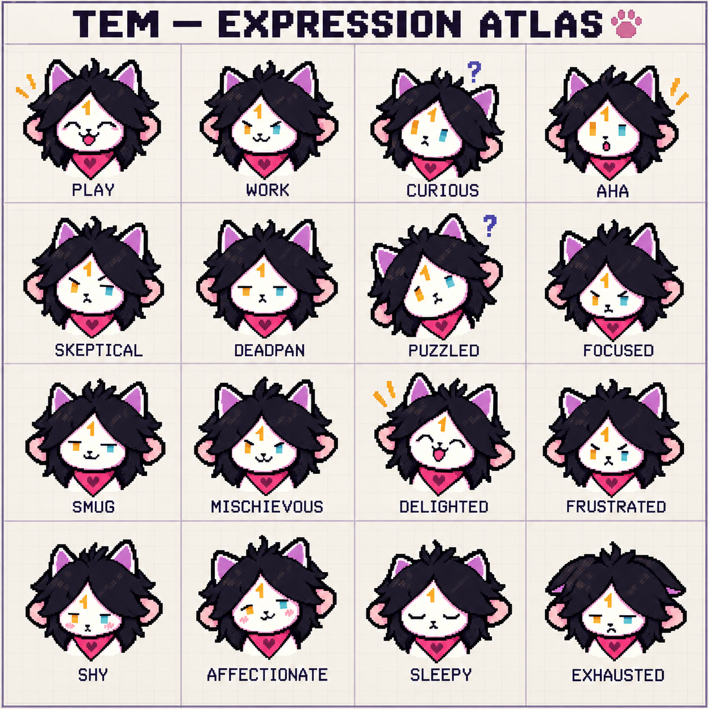

# Tem character archive

Creator-approved model sheet for hair, face, slim biped/quadruped shapes, plus a16-expression extension. These are mandatory character references for future artwork.

Read [art direction](../../docs/ART_DIRECTION.md) and [face/body study](../../docs/TEM_CHARACTER_EXPRESSIONS.md). Exact generation prompts, source references and file hashes are retained in MANIFEST.json. The written palette and construction rules take precedence over incidental generated copy/swatches. Environment references must not override this character identity.
