# Meet Tem's features

Tem combines a selected language model with persistent memory, tools and a familiar personality. This guide introduces the ideas and links to their design documents. For implementation maturity and known gaps on the modernization branch, consult the [feature audit](modernization/FEATURE-COVERAGE.md) and [current status](modernization/IMPLEMENTATION-STATUS.md).

Illustrations describe concepts. Detailed architecture, supported platforms and verification limits belong in the linked documentation.

## Coding and computer use

### Tem-Code

Inspect a codebase, make targeted edits and run checks. The design emphasizes reading before editing and preserving useful state while working through a task.

[Research](../tems_lab/code/RESEARCH.md)

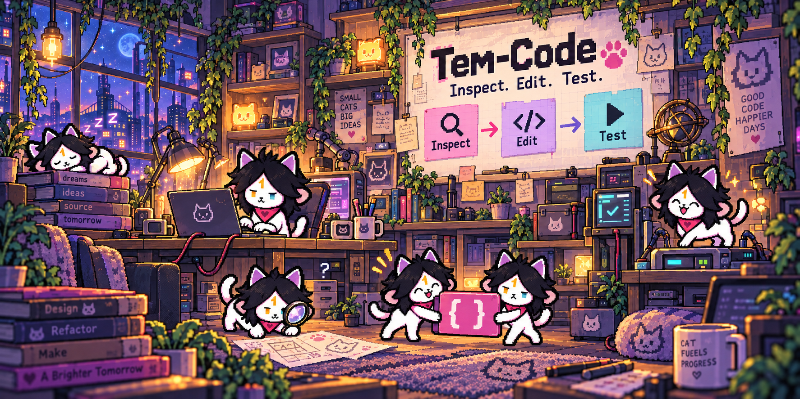

### Prowl and Gaze

Prowl provides browser-oriented workflows, including separate browser authentication flows. Gaze adds visual desktop interaction. Available actions depend on the OS, display session and permissions; a screen change alone is not proof that a task succeeded.

[Desktop design](../tems_lab/gaze/DESIGN.md) · [Deployment](DEPLOY_AUTONOMOUS_DESKTOP.md)

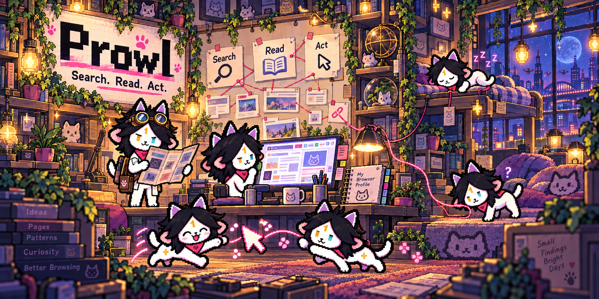

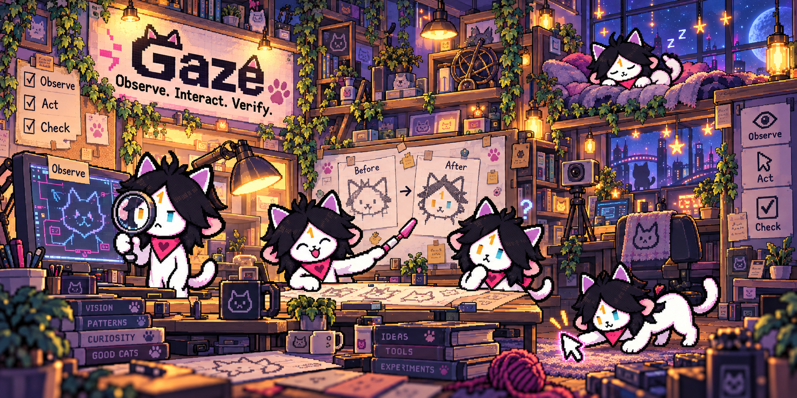

### Web search

A unified search tool can query multiple sources and return results for the model to inspect. Backend availability varies. Cached results must respect the full request, including requested sort order.

[Search research](web_search/RESEARCH.md)

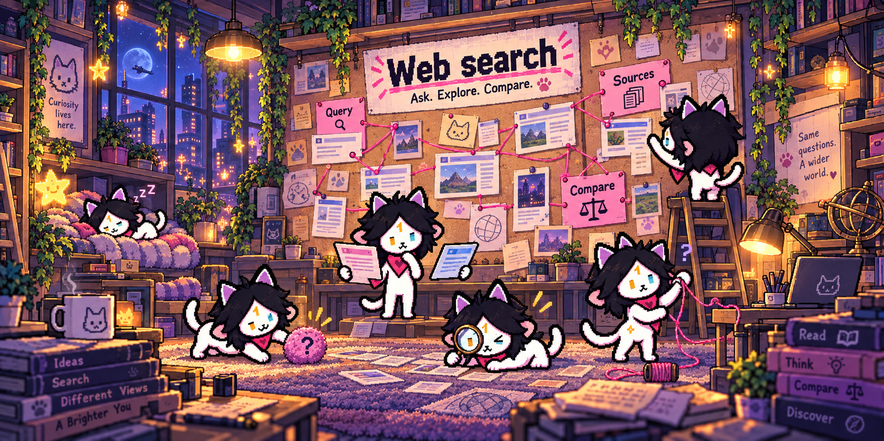

## Memory and personality

### λ-Memory and Engram

λ-Memory maintains multiple levels of detail for episodic memories, with references to stored material. Engram maintains longer-lived facts, including explicit user instructions to remember, correct or forget information. Context compaction manages the active conversation; it does not replace either memory system.

[λ-Memory](../tems_lab/LAMBDA_MEMORY.md) · [Engram](../tems_lab/ENGRAM_MEMORY.md) · [Context and caching audit](modernization/07-CONTEXT-CACHING.md)

### Blueprints and artifact value

Blueprints capture reusable procedures. Memories, lessons and other artifacts have scores intended to help select useful material under a finite context budget. Quality, recency and utility are ranking signals, not proof that an artifact is correct.

[Blueprint design](design/BLUEPRINT_SYSTEM.md) · [Artifact value design](../tems_lab/ARTIFACT_VALUE_FUNCTION.md) · [Math audit](modernization/MATH-AUDIT.md)

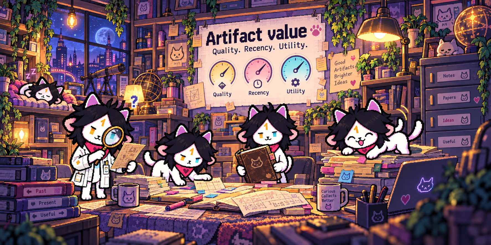

### Conscious and Anima

Conscious provides reflective observations and lessons. Anima is Tem's personality and relationship layer: a familiar voice, constructive disagreement and adaptation to the user. These ideas support continuity without giving personality authority over facts or evidence.

[Conscious research](../tems_lab/consciousness/RESEARCH_PAPER.md) · [Anima architecture](../tems_lab/social/TEM_EMOTIONAL_INTELLIGENCE_ARCHITECTURE.md)

## Coordination

### Many Tems

The swarm decomposes suitable work into tasks, coordinates workers through a shared store and collects their outcomes. Parallel work needs dependency and resource controls; historical speedups apply to the experiments that measured them.

[Swarm design](../tems_lab/swarm/DESIGN.md) · [Historical experiment](swarm/experiment_artifacts/EXPERIMENT_REPORT.md)

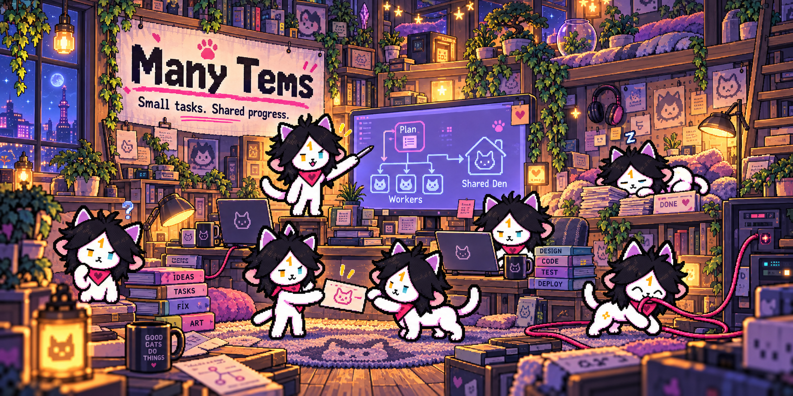

### TemDOS

TemDOS provides specialist cores with distinct roles and continuity. It is a different idea from temporary swarm workers: expertise and accumulated context can remain associated with a specialist over time.

[TemDOS research](../tems_lab/temdos/TEMDOS_RESEARCH_PAPER.md)

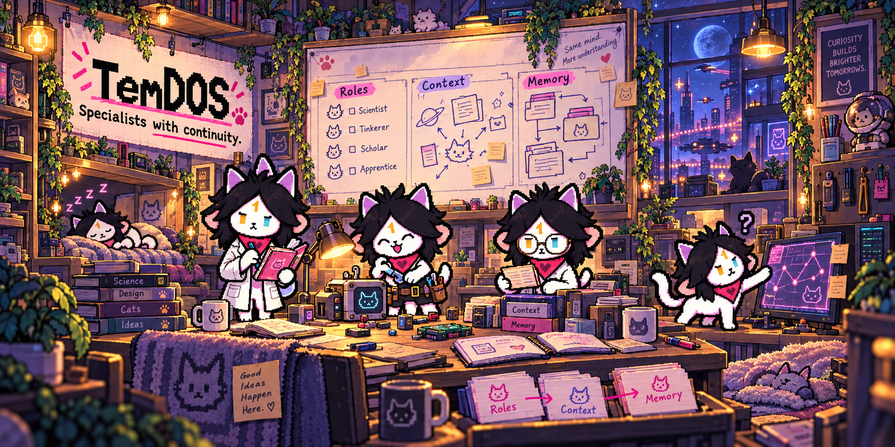

## Persistent work

### Perpetuum

Perpetuum adds schedules, concerns, monitors and background initiative. The modernization work aims to make each activity budgeted, recoverable and honestly reported. A skipped handler is not completed maintenance.

[Perpetuum vision](../tems_lab/perpetuum/VISION.md)

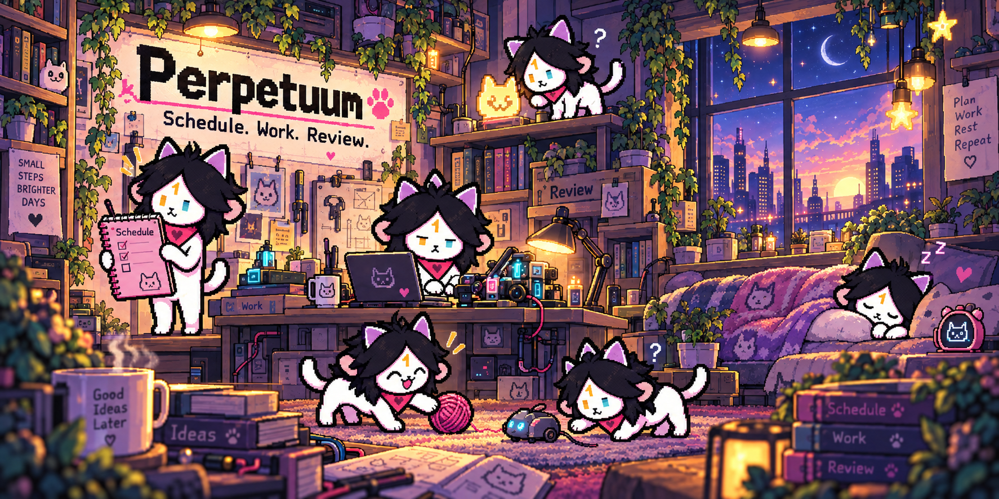

### Terminal and messaging

The TUI is the interactive terminal front end. Its confirmed modernization direction is a compact transcript with expandable tools and optional panels. Messaging channels provide another way to work with the same companion. Entrypoint parity is a release requirement, not something inferred from library tests.

[TUI design plan](modernization/08-TUI.md) · [Commands](CLI_REFERENCE.md)

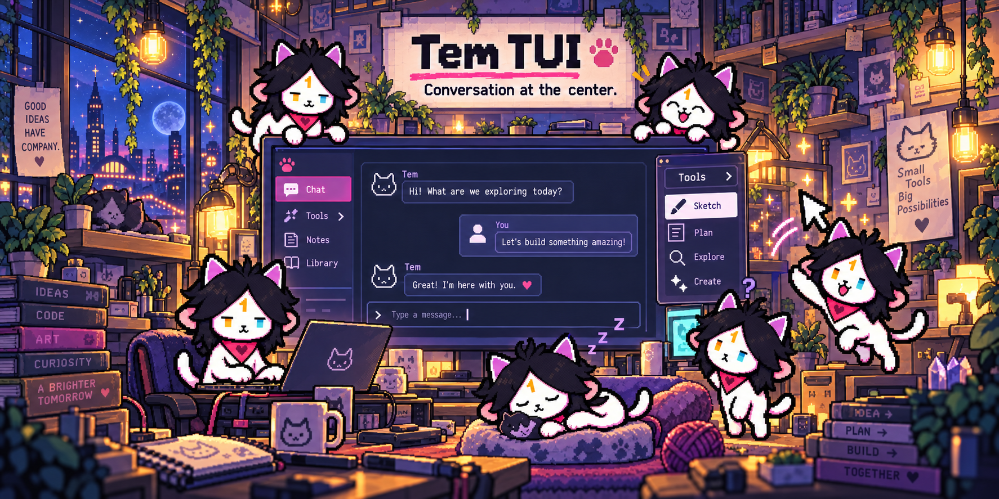

### Access control

Roles determine available operations. Personal host access and shared-service isolation require different boundaries; role labels alone do not provide operating-system isolation.

[Isolation findings](modernization/03-FINDINGS.md)

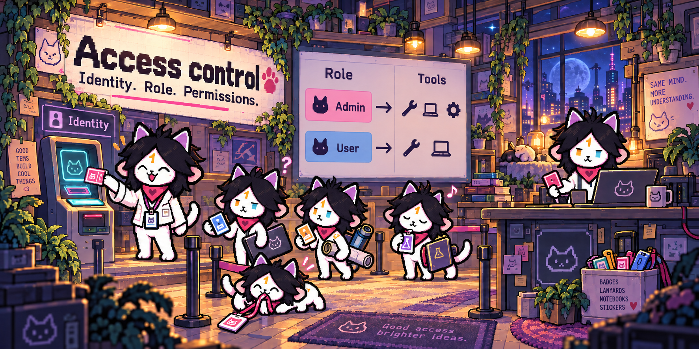

## Extensions and experiments

### Skills and MCP

Skills are reusable instruction sets, discoverable in global or workspace skill directories. MCP connects external tools and services. Instructions and tool output must retain their source and authority rather than silently becoming trusted system policy.

Use `temm1e skill list` to inspect skills, or `/mcp` to inspect connected servers.

### Eigen-Tune

Eigen-Tune collects examples, trains a local model and evaluates it before optional local routing. Collection/training and user-facing routing are separate opt-ins. Training, evaluation and local inference still consume resources. Statistical gates must be inconclusive when evidence is insufficient.

[Design](../tems_lab/eigen/DESIGN.md) · [Setup](../tems_lab/eigen/SETUP.md) · [Routing safety](../tems_lab/eigen/LOCAL_ROUTING_SAFETY.md)

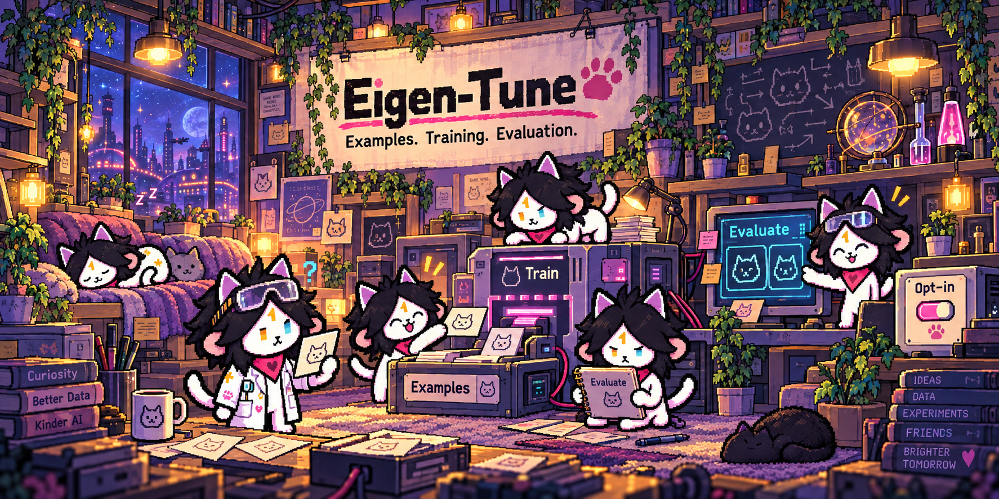

### Cambium

Cambium is the self-growth idea: propose capability changes, evaluate them and retain a recoverable history. Its protected zones and verification stages must be implemented and tested before a change can be treated as safe to deploy.

[Research](../tems_lab/cambium/CAMBIUM_RESEARCH_PAPER.md) · [Protected zones](lab/cambium/PROTECTED_ZONES.md)

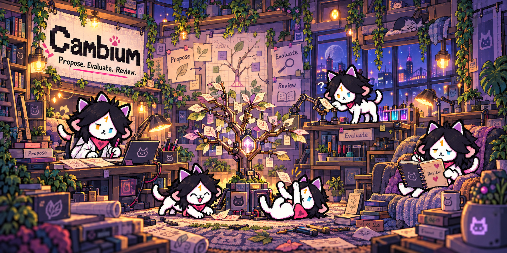

## Evidence and diagnostics

### Witness

Witness records pre-committed checks and their verdicts in a ledger. Its purpose is to connect completion claims to evidence. A check only establishes the property it actually examines; file existence is not semantic correctness, and a hash chain alone does not prevent its owner from rewriting local storage.

[Witness research](../tems_lab/witness/RESEARCH_PAPER.md)

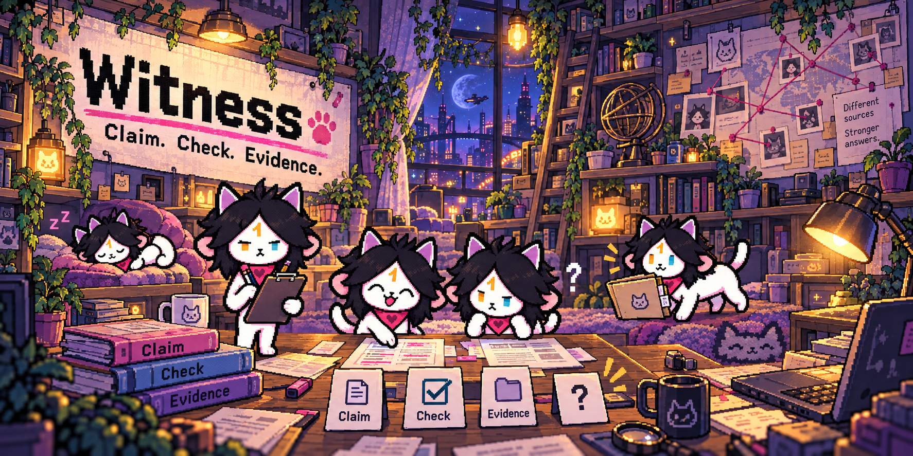

### Vigil

Vigil detects failures and prepares diagnostic reports. Reports need relevant evidence and redaction. External publication remains subject to the configured consent and reporting policy.

[Vigil design](../tems_lab/vigil/DESIGN.md)

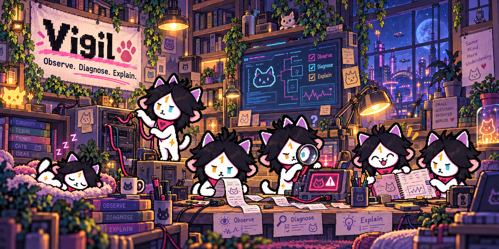

## What proves an improvement?

The [A/B protocol](modernization/BENCHMARK-PROTOCOL.md) compares the old and modern runtime with matched models, tasks and resource limits. Verified task success and unsupported completion claims are primary metrics; latency, token use, cache behavior, recovery, memory retention and interface usability provide the rest of the picture. Historical lab reports remain available, separately from the new release evidence.
