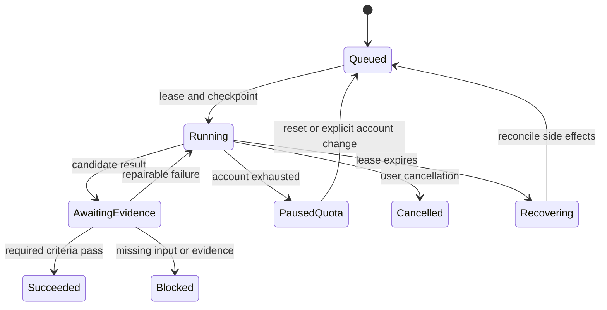

# Target architecture

Status: proposal, not implementation. Keep Rust, the trait-based workspace, messaging-first Tem identity, user-selected intelligence, and all distinctive feature families. Repair incrementally; do not replace the project with a competitor wrapper.

## One execution contract

Introduce a shared `ExecutionContext` carrying principal ID, workspace ID, goal ID, turn ID, cancellation handle, budget reservation and capability snapshot. Every agent, core, Hive worker, maintenance job and provider request receives it. None may substitute CWD, Admin or an independently guessed model limit.

The execution ledger owns these transitions:

Delivery status is separate: a partial answer can be Delivered while the goal is Blocked or still Running. Witness Law 5 and continued pursuit need creator resolution; never manufacture Succeeded from delivery. Failure is an explicit terminal state when recovery policy is exhausted, with evidence and reason, not a model sentence.

Persist versioned goal, criterion, event, tool operation, evidence, lease and delivery-outbox records in SQLite first. Each event has immutable ID, goal/turn IDs, sequence and timestamp. Lease acquisition is transactional with owner/generation/deadline; stale workers cannot commit using an old generation. Use an outbox for messages; exactly-once external side effects are not generally possible. Save idempotency keys where APIs support them and reconcile unknown outcomes otherwise.

## Boundaries

| Boundary | Owns | Must not own |
|---|---|---|
| Composition factory | resolved config, account/model snapshot, shared services | duplicated builder logic per slash command |
| Execution service | durable goal lifecycle, admission, cancellation | semantic judgment by string matching |
| Context compiler | complete wire-ready context within capacity | silent truncation of goals/tool relationships |
| Model gateway | protocol codecs, usage, credential references, account quota | secret-bearing prompts, guessed entitlement |
| Tool executor | capabilities, deadlines, process cleanup, effects, evidence | treating description/annotations as trusted permissions |
| Memory service | scoped recall, provenance, value/retention policies | cross-user global retrieval by default |
| Witness | criterion-specific evidence assessment | editing the user's objective or accepting model completion prose |
| Delivery adapters | message IDs, limits, retries, reconnect | marking a goal complete when a message sends |
| Learning services | versioned artifacts and measured promotion | bypassing shared budget or evidence |

Consciousness remains a metacognitive assistant; Anima remains communication adaptation; Blueprints remain procedural retrieval; Engram remains durable memory; λ remains graded recall. Hive coordinates independent work; TemDOS supplies specialist evidence to the main agent. Perpetuum schedules durable goals. Cambium generates reviewed artifacts through explicit real gates. Eigen stays double opt-in and must earn promotion on independently grounded evidence. All use the same execution, resource and identity contracts.

## Context invariant

Before network send, enforce `input_tokens + reserved_output + protocol_margin <= resolved_context_capacity`. Include tool schemas, images, base AND volatile instructions, retained tool call/result pairs, reasoning metadata needed by the protocol and all dashboards. Prefer actual tokenizer/provider counting; when only estimates exist, expose uncertainty and reserve margin. If fixed required content alone exceeds capacity, fail with a recoverable context error. Never silently evict the user's active goal. Store large outputs as scoped artifacts with bounded excerpts.

## Compatibility and migration

1. Add types and fake adapters without changing defaults. Snapshot current wire requests and representative sessions.
2. Fix P01 immediately, then enable the ledger behind a versioned config flag in one CLI path.
3. Route all entrypoints through the factory and compare replayed tool events before enabling by default.
4. Dual-read old memories/configs; single-write new schema after backed-up migration. Never infer an owner for ambiguous shared records: quarantine for assignment.
5. Preserve configured models, personality, skills, concern schedules and credentials. Token migration reads old files without copying secrets into logs.
6. Remove legacy managers only after feature mapping and replacement acceptance tests. Mark retired public modules deprecated for a release rather than breaking consumers silently.

Rollback stops new-schema writers first. Restore schema-compatible service/config; retain the ledger for inspection. Avoid rolling back by deleting task history or issuing tool calls again. Cloud orchestration remains an explicit later stage; first prove one process with multiple isolated principals.
